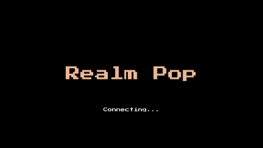
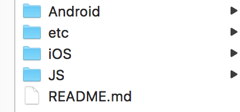
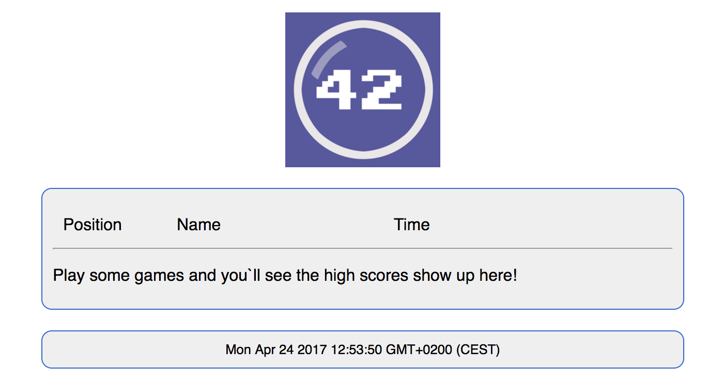

# Realm Pop 1.1
### Basic multi-player game demo, using Realm Mobile Platform



Table of contents:

* [Gameplay](#gameplay)
* [Contents](#contents)
* [Step-by-step installation](#installation)
* [Credits](#credits)

## Gameplay

Once on the game screen, players need to clear the level by always tapping the highest available number.

* tapping a wrong number immediately ends the round, the opposite player wins (no score reported though),
* tapping "0" ends the round for the current player and shows their time, the game waits until the opposite player mistakes or taps all of their bubbles,
* if the player clears their level and the opposite side doesn't finish in another 20 seconds, the current player wins,
* if the player plays for more than 60 seconds they fail the round.

## Contents



### Android

An Android version of the game, implementing the same logic as the iOS one.

### iOS

An iPhone multi-player game with full source.

### JS

A Node.js app component of the game that shows how to implement custom server-side logic.

## Installation

The game can be installed and run on a variety of configurations, this step by step tutorial shows you how to run the game locally on your mac computer.

### 1. Install Realm Mobile Platform PE:
  
  a) sign up for Professional Edition Trial here: [https://realm.io/pricing/realm-professional-edition/](https://realm.io/pricing/realm-professional-edition/)
  
  b) you'll receive an email with instructions and a download link. Download the platform by clicking on the link "**Download for macOS**".
  
  c) unzip the downloaded file on your computer and in your terminal app navigate to the resulting folder. Type `./start-object-server.command` to start the Realm Object Server.
  
  d) in the web browser that pops up create an admin account with the following user: `admin@realm` and pass: `password`. This is your root admin user to access the web console.
  
  e) once logged in click "**+New User**" to create a new user, enter email "`default@realm`", password "`password`". This will be the common user account the game will use to connect.

### 2. Configure the RealmPop server app

a) in the folder, where you unarchived the platform navigate to the `realm-object-server` sub-folder. You should see the file `admin_token.base64`, this is a token your server app can use to connect to the server.

b) in the same folder create a new empty file called `access_token.base64`. This file will contain the token that enables the PE features of your server installation. 

c) copy the text token that was sent to you in the trail email and paste it into `access_token.base64`. (The token is all characters in between the double quotes):


d) Next copy the game user ID from the server web console. Click on "**Users**" to see the list of server users and copy the id of `default@realm`:


e) Finally create one more file called `pop-credentials.txt` to store the user credentials the server app will use to connect to the server. Append to the file as follows (replacing USER_ID with the actual id from your server): 

```none
USER_ID:default@realm:password
```

f) since you need a number of configuration variables to run the game, it's easier to create a `.sh` file to start the server app with all the correct parameters. In the `JS` folder of this repo create a new file and call it `pop.sh`. Add into the file:

```bash
node pop.js [YOUR_IP] 9080 \
  /[PATH_TO]/realm-object-server/admin_token.base64 \
  /[PATH_TO]/realm-object-server/access_token.base64 \
  /[PATH_TO]/realm-object-server/pop-credentials.txt \
  /[PATH_TO]/web
```

Replace all the paths above with the path on your computer. The last one points to the location where the server app should export the high scores board web page. If you don't have a web server on your computer, just create a folder called `web` inside the RealmPop folder,

g) make `pop.sh` executable: `chmod +x pop.sh`

### 3. Running the server app

a) you first need to make sure you have Node.js installed. If you don't have it the easiest way is through using homebrew `brew install node`, or the installer provided at: [https://nodejs.org/en/download/current/](https://nodejs.org/en/download/current/),

b) copy `realm-1.4.2-professional.tgz` from `realm-mobile-platform-professional/SDKs/node` to your RealmPop's `JS` sub-folder,

**NB**: In case the version number differs for you, make sure to update the node module file name in `package.json` to the correct file name.

c) in the terminal navigate to the `JS` sub-folder of RealmPop and install the dependencies by typing `npm install`,

e) and finally start the server app: `./pop.sh`.

### 4. Running the web high scores board

In case you have a running web server on your computer just adjust the last parameter in `pop.sh` to point to the server's public html folder. Otherwise follow these steps:

a) in your RealmPop folder create a sub-folder called `web`

b) make sure in `pop.sh` the last parameter points to the newly created `web` sub-folder. If you made changes, stop the app and start it again.

c) in your terminal navigate to `web` and type in: `ruby -run -e httpd . -p 8080`. This will start a tiny web server listening on your `8080` port.

d) open the high score board in your web browser by navigating to `http://localhost:8080/` and you will see the high scores. Names will appear shortly after you play (and win) some games



### 5. Running the iOS app:
  
  a) in your terminal navigate to `RealmPop/iOS` and type in `pod update` and when that command has completed type `pod install` to install the project dependencies,
  
  b) open `RealmPop.xcworkspace` and find `RealmPop/Application/RealmConnect.swift` - change the value of `host` to whatever your IP is (this will allow you to connect to the Realm Object Server when testing from your device).
 
### 6. Running the Android app:

a) for the Android app use the provided gradle script, more details here: [See Android Sub-project](Android#installation-instructions)

Enjoy and have fun with RealmPop!

## License

Realm Pop is available under the MIT license. See the LICENSE file for more info.

_Press Start 2p_ is a free font under the SIL Open Font License(OFL). For more information: [http://www.fontspace.com/codeman38/press-start-2p](http://www.fontspace.com/codeman38/press-start-2p).
